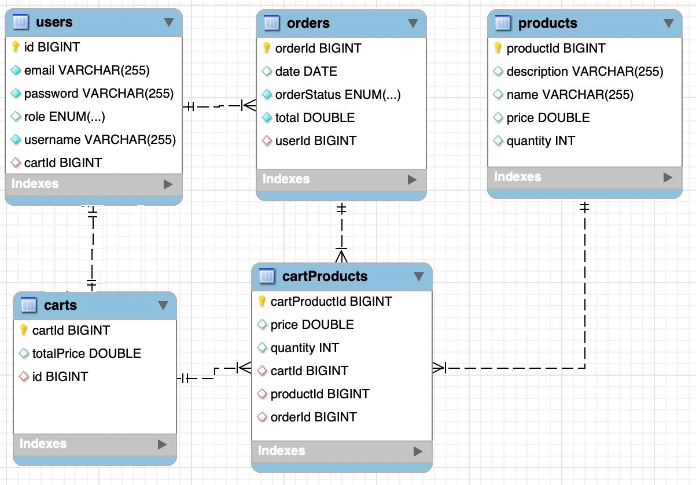

Rest Api for an E-Commerce Application

 This REST API was developed as a part of the final project during the project-weeks at StatStep Education School. 
 Serving as the backend for an E-Commerce application, it was crated to meet the demands of modern online retail.
 
 Technologies Used
 Spring Boot: Spring framework for creating scalable and efficient Java applications.
 Spring Data JPA: to simplify data access and manipulation.
 Hibernate: for object-relational mapping and simplified database interaction.
 MySQL Database: as a database management system for data storage and retrieval.
 Lombok: Increase code readability and conciseness through the use of Lombok annotations.
 Logging: Implement logging in SLF4J for efficient debugging, bug tracking, and system monitoring.

Getting Started
Clone the Repository:
git clone https://github.com/MariiaLobanova/E-Commerce-Shop-RESTful-API
cd your-repository
Build and Run:

API Documentation:
Access the Swagger API documentation at http://localhost:8090/swagger-ui/index.html#/
for comprehensive API details and testing.

Diagram for the application

Modules: 
- User;
- Product;
- Cart;
- Order.

Features:

- User authentication and validation with session token having validity of 24 hours for security purpose,
- Admin Role with valid session token can add/delete/uddate products and see whole list of users,
- All users can see products and logged in User as a Role with valid session token can add products to a cart, 
see list of products in the cart, placing orders, see history and status of his orders.

 